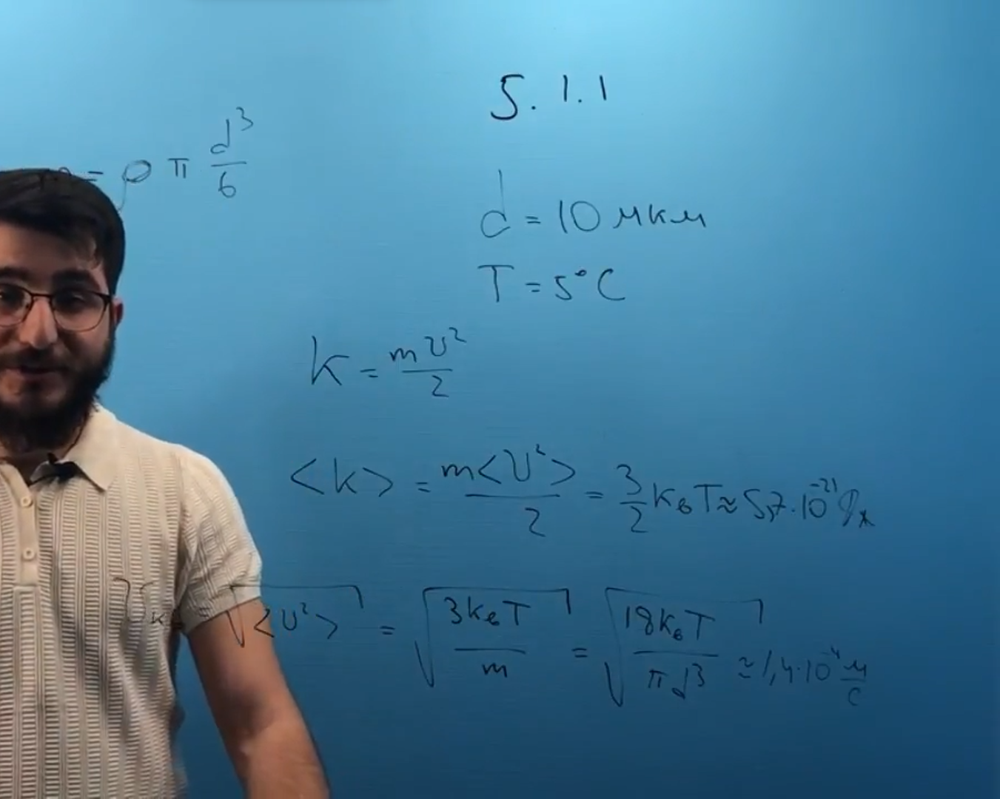

###  Условие:

$5.1.1.$ Оцените среднюю кинетическую энергию и среднеквадратичную скорость частичек тумана диаметра $10\mathrm{~мкм}$, находящихся в воздухе при температуре $5 \, ^{\circ}C$.

###  Решение:

###  Ответ:

$$
K\approx5{,}8\cdot10^{-21}\mathrm{~Дж,~}\sqrt{\langle v^{2}\rangle}\approx1{,}5\cdot10^{-4}\mathrm{~м/c.}
$$