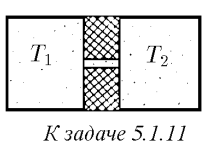
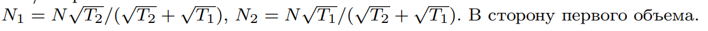

###  Условие: 

$5.1.11^*.$ Два сосуда одинакового объема $V$ соединены узким каналом. В сосудах находится небольшое число частиц $N$ (т. е. частиц так мало, что они почти не сталкиваются друг с другом). Сколько частиц окажется в каждом из сосудов, если температура газа в одном сосуде равна $T_1$, а во втором — $T_2 > T_1$? В соединительный канал поместили легкий флажок. В какую сторону он отклонится? 

 

###  Решение: 

 

 

###  Альтернативное решение: 

 

###  Ответ: 

### 

 
