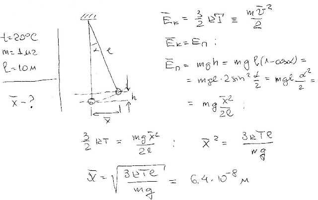
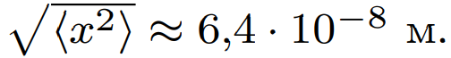

###  Условие: 

$5.1.4.$ Определите среднеквадратичное отклонение маятника от положения равновесия, вызываемое тепловым движением шарика маятника. Температура воздуха $20 \,^{\circ}C$. Масса шарика $1 \,мг$, длина нити маятника $10 \,м$. 

###  Решение: 

 

###  Ответ: 

 
