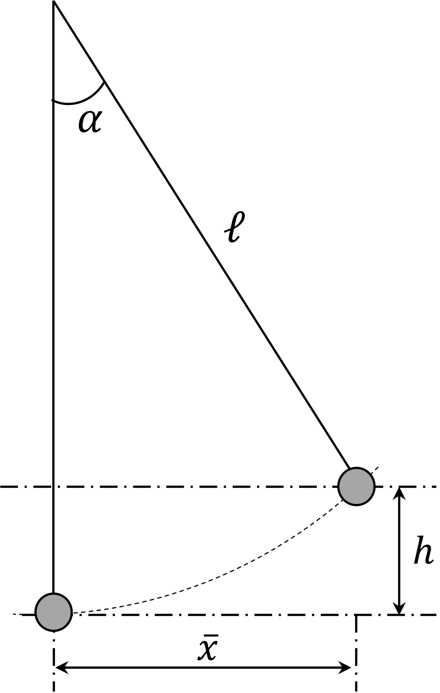

###  Условие: 

$5.1.4.$ Определите среднеквадратичное отклонение маятника от положения равновесия, вызываемое тепловым движением шарика маятника. Температура воздуха $20 ~^{\circ}C$. Масса шарика $1 \mathrm{~мг}$, длина нити маятника $10 \mathrm{~м}$. 

###  Решение: 

   
Предположим, что шарик маятника ведёт себя как частица в тепловом равновесии со средой при температуре $T$. Тогда средняя кинетическая энергия шарика связана с температурой по формуле:

$$\bar{E}_K = \frac{3}{2}kT=\frac{m\bar{v}^2}{2}\tag{1}$$

где $k$ — постоянная Больцмана, $T$ — абсолютная температура.

В условии равновесия и малых колебаний мы можем приравнять среднюю кинетическую энергию к средней потенциальной энергии отклонения маятника:

$$\bar{E}_K = E_p\tag{2}$$

Потенциальная энергия при отклонении маятника на угол $\alpha$ от вертикали:

$$E_p = mgh = mg\ell(1-\cos\alpha)\tag{3}$$

где $m$ — масса шарика, $\ell$ — длина нити маятника, $g$ — ускорение свободного падения.

Для малых углов $\alpha$, используя приближение $\sin\alpha \approx \alpha$, получим:

$$E_p=mg\ell\cdot2\sin^2\frac{\alpha}{2}\approx mg\ell\cdot\frac{\alpha ^2}{2}\tag{4}$$

Учитывая связь углового смещения $\alpha$ и линейного смещения $\bar{x}$ при малых углах:

$$\bar{x} \approx \ell \alpha\tag{5}$$

Подставляем $(5)$ в $(4)$:

$$E_p=mg\frac{\bar{x}^2}{2\ell}\tag{6}$$

Учитываем $(6)$ в тождестве $(2)$

$$\frac{3}{2}kT=mg\frac{\bar{x}^2}{2\ell}\tag{7}$$

Откуда выражаем линейное смещение $\bar{x}$

$$
\boxed{\bar{x}=\sqrt{\frac{3kT\ell}{mg}} = 6.4\cdot10^{-8}\mathrm{~м}}\tag{8}
$$
###  Ответ: 

$$\sqrt{\langle x^2\rangle}\approx6{,}4\cdot10^{-8}\mathrm{~м}.$$
