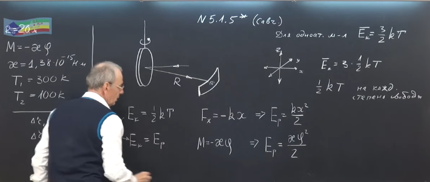
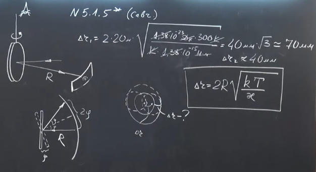
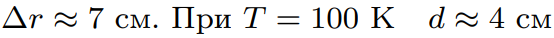

###  Условие: 

$5.1.5^{∗}.$ Зеркальце гальванометра подвешено на кварцевой нити. На зеркальце падает узкий параллельный луч света и, отражаясь от него, попадает на экран, расположенный на расстоянии $20\,м$ от зеркальца. Температура воздуха $300\,K$. Оцените, на сколько увеличится радиус светового пятна на экране в результате теплового движения зеркальца, если при повороте зеркальца на угол $\varphi $ на него со стороны нити действует момент сил $M = −\kappa\varphi $, где $\kappa = 1.38 · 10^{−15} \, Н \cdot м$. Как изменится ответ, если температуру воздуха понизить до $100\,K$? 

###  Решение: 

 

 

 

###  Ответ: 

 
