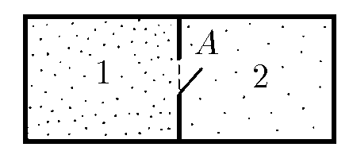
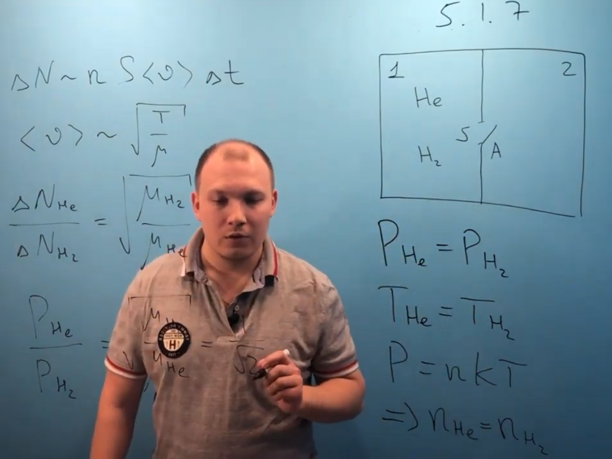

###  Условие:

$5.1.7.$ В секции сосуда находится смесь гелия с водородом. Давление водорода и гелия одинаково. В секции $2$ сосуда вакуум. На короткое время в перегородке открывают отверстие $A$ Определите отношение давления гелия к давлению водорода в секции $2$

###  Решение:

#### Ответ: $P_{He}/P_{H_2} = 1/ \sqrt{2}.$