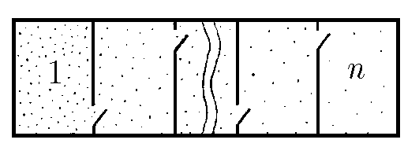
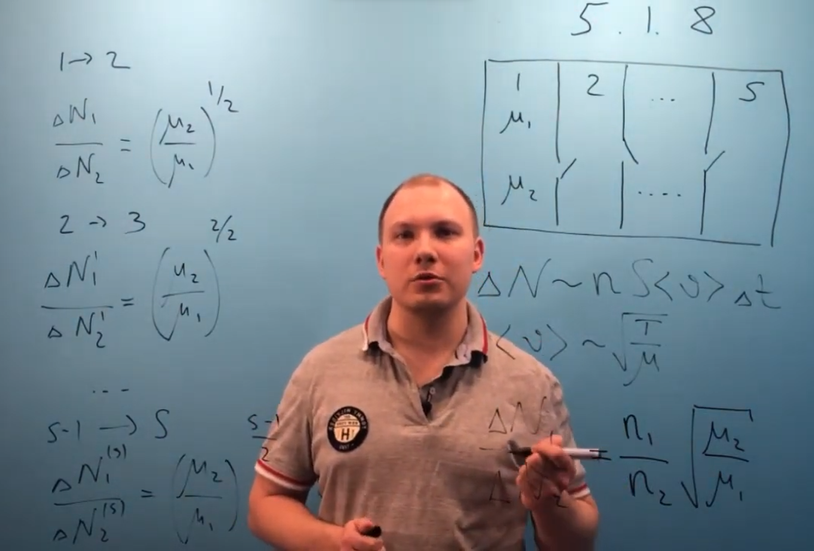

###  Условие: 

$5.1.8^*.$ Сосуд разделен перегородками на n изолированных секций. В начальный момент в секции $1$ находится одинаковое число молекул с молярной массой $\mu_1$ и $\mu_2$. В остальных секциях вакуум. На короткое время в перегородках открывают небольшие отверстия, как показано на рисунке. Оцените отношение числа молекул с молярной массой $\mu_1$ к числу молекул с молярной массой $\mu_2$ в $n$-й секции сосуда. 

###  Решение: 

 

 

###  Ответ: $N_1/N_2 = {(\mu 2/\mu 1)}^{(n−1)/2}$ 

### 
