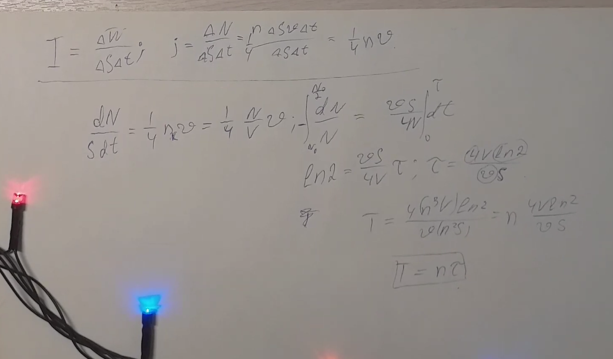
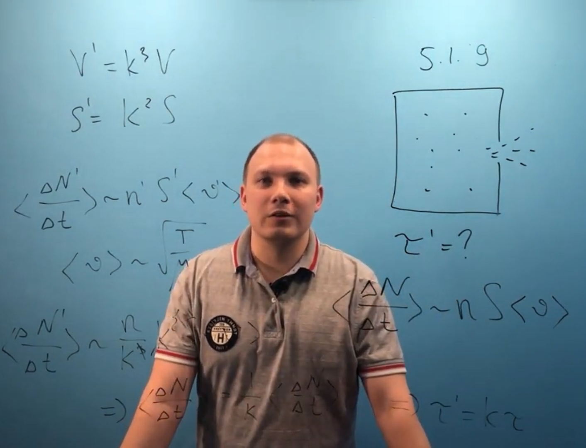

###  Условие:

$5.1.9^{∗}.$ Из сосуда через отверстие в стенке вытекает за время $\tau$ половина разреженного газа. За какое время вытекла бы половина этого же газа, если бы все размеры сосуда (в том числе и размеры отверстия) были в $n$ раз больше?

###  Решение:

###  Аналогичное решение:

###  Ответ: ${\tau}' = n\tau$