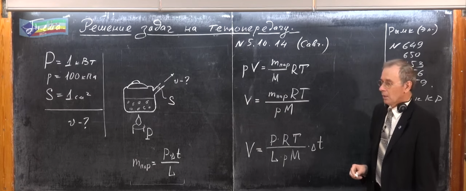
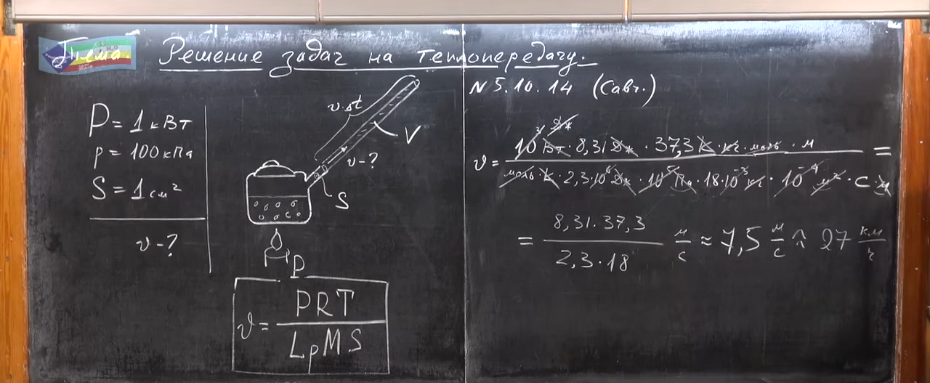

###  Условие:

$5.10.14.$ На электрической плитке мощности $1 \,кВт$ кипит вода в чайнике. Найдите скорость истечения пара из носика чайника, если пар считать идеальным газом. Давление пара на конце носика $1 \,атм,$ сечение носика $1 \,см^2$ . Считать, что вся энергия плитки передается воде.

###  Решение:

#### Ответ: $v \approx 8 \,м/с$