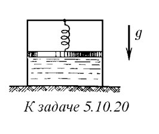
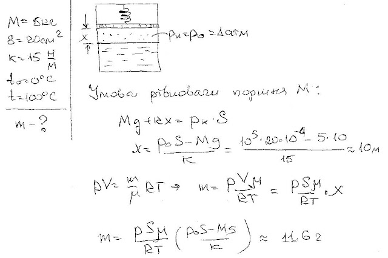

###  Условие: 

$5.10.20.$ Цилиндр сечения $20 \,см^2$ разделен поршнем массы $5 \,кг$ на две части. В нижней его части вначале находится вода, а верхняя часть откачана. Поршень соединен с цилиндром пружиной жесткости $15 \,Н/м$. Вначале пружина не деформирована. Определите массу образовавшегося пара при нагревании воды от $0$ до $100 \,^{\circ}C$. Трением можно пренебречь. 

 

###  Решение: 

 

###  Ответ: $m = 11.7 \,г$ 
