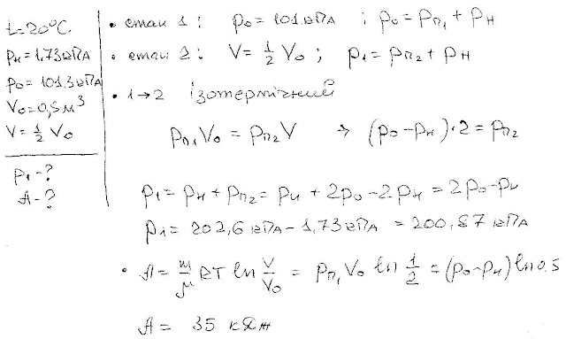

###  Условие:

$5.10.21.$ В цилиндре, закрытом поршнем, при температуре $20 \,^{\circ}С$ находится воздух, на дне цилиндра — капелька воды. Чему будет равно давление в цилиндре после изотермического уменьшения объема под поршнем в два раза? Какую для этого нужно совершить работу? Первоначальный объем $0.5 \,м^3$, давление насыщенного пара при температуре $20 \,^{\circ}С$ равно $1.73 \,кПа$. Начальное давление $101.3 \,кПа$.

###  Решение:

#### Ответ:

$$
P=0{,}2\mathrm{~MПa,~}A=35\mathrm{~кДж}.
$$