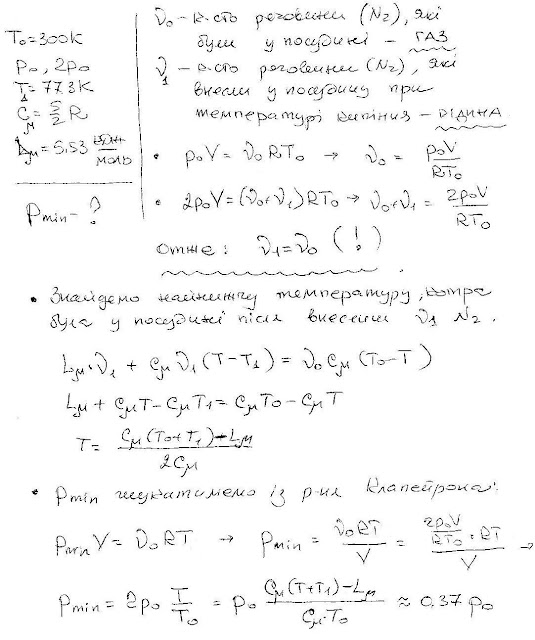

###  Условие: 

$5.10.22.$ В прочном закрытом сосуде находится азот при температуре $300 \,K$ и давлении $P_0$. В сосуд впрыскивается некоторое количество распыленного жидкого азота при температуре кипения $77.3 \,K$, который быстро испаряется. Спустя продолжительное время, когда температура станет равна начальной, в сосуде устанавливается давление $2P_0$. Определите, каким было минимальное давление азота в сосуде после впрыскивания. Молярная теплоемкость азота $c = (5/2)R$, его молярная теплота парообразования $5.53 \,кДж/моль$. 

###  Решение: 

 

###  Ответ: $P = 0.37 P_0$ 
