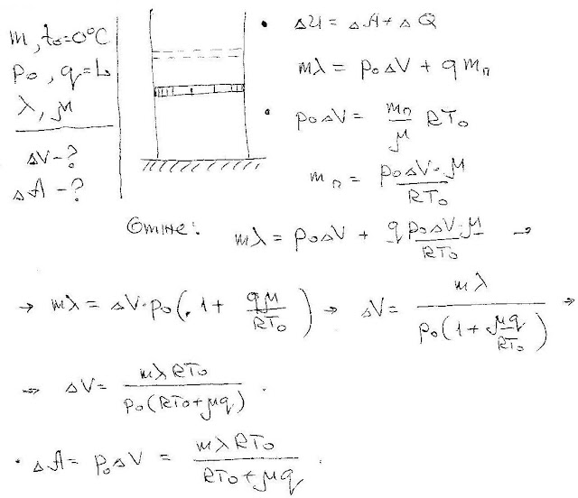

###  Условие:

$5.10.23.$ В достаточно большой откачанный цилиндр, закрытый поршнем, помещено немного воды со льдом. Масса льда $m$, температура $0 \,^{\circ}С$, давление насыщенного пара воды при $0 \,^{\circ}С$ равно $P_0$. На сколько нужно изменить с помощью поршня перекрытый объем, чтобы весь лед растаял? Какую при этом нужно совершить работу? Удельная теплота парообразования $q$, удельная теплота плавления льда $λ$, молекулярная масса воды $\mu$.

###  Решение:

#### Ответ:

$$
\Delta v=m\lambda RT/[P_0(\mu q+RT)]
$$

$$
A=m\lambda RT/(\mu q+RT).
$$