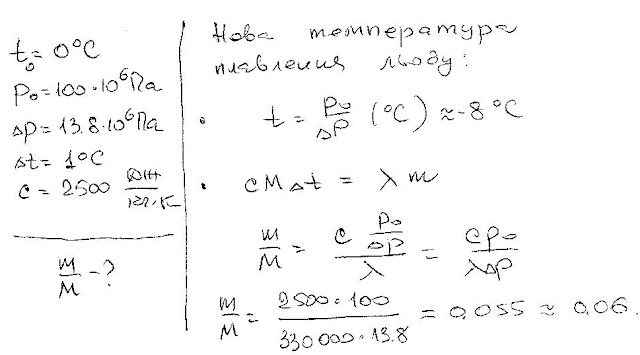

###  Условие:

$5.10.26.$ Лед при температуре $0 \,^{\circ}С$ заключен в теплонепроницаемую оболочку и подвергнут давлению $100 \,МПа$. Какая часть льда расплавилась, если при повышении давления на $13.8 \,МПа$ температура плавления льда понижается на $1 \,^{\circ}С$? Удельная теплоемкость льда $2.5 \,кДж/(кг \cdot К)$.

###  Решение:

#### Ответ: $5 \% $ льда