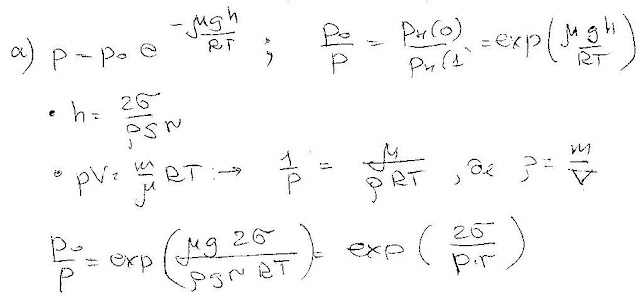

###  Условие:

$5.10.27.$ а. Во сколько раз давление насыщенного пара над поверхностью жидкости, поднявшейся по капилляру на высоту $h$, меньше давления насыщенного пара над плоской поверхностью? Молекулярная масса жидкости $m$, температура $T$. Определите это же отношение давлений через радиус кривизны жидкости $r$, поверхностное натяжение $\sigma$ и плотность жидкости $\rho$.
б. В замкнутом сосуде в равновесии находятся при комнатной температуре две капли воды радиуса соответственно $r_1 = 1 \,мм$ и $r_2 = 1.1 \,мм$. Как отличаются высоты, на которых они находятся?

###  Решение:

#### Ответ:

$\mathrm{a.~}n=\exp(mgh/RT)=\exp(2m\sigma/\rho r).$
$\mathrm{б.~}\Delta h=15\mathrm{~c}\mathrm{м}.$