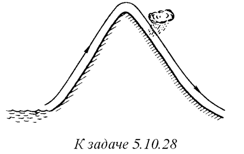
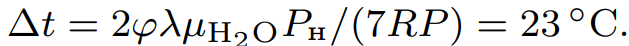

###  Условие: 

$5.10.28.$ Влажный воздух, который переносится ветром с тихоокеанского побережья, поднимаясь по склонам Кордильер, расширяется и охлаждается. При этом содержащийся в воздухе водяной пар выпадает в виде осадков. Оцените, на сколько различаются значения температуры воздуха у подножья по обе стороны Кордильер, если его влажность у побережья $ϕ = 60 \%$, а температура $t_1 = 25 \,^{\circ}C$. При такой температуре давление насыщенного водяного пара $P_н = 34 \,кПа$. Удельная теплота парообразования воды $λ = 2,5 \cdot 10^6 \,Дж/кг$. Атмосферное давление у подножья гор $P = 10^5 \,Па$ 

 

###  Решение: 

 

###  Ответ: 

 
