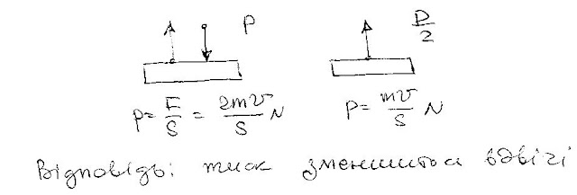

###  Условие: 

$5.10.29.$ Давление насыщенного пара над твердым телом равно $P$. Как изменится давление на поверхность этого тела, если пар полностью откачать, а температуру тела сохранить прежней? 

###  Решение: 

 

###  Ответ: Уменьшится в два раза. 
