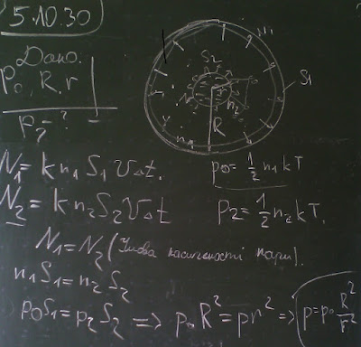

###  Условие:

$5.10.30.$ В центре откачанного сосуда радиуса $R$ находится жидкая капля радиуса $r$. Стенки сосуда полностью поглощают испаряющуюся с капли жидкость. Давление на стенку сосуда $P_0$. Определите давление на поверхность капли.

###  Решение:

###  Ответ: $P = P_0(R/r)^2$