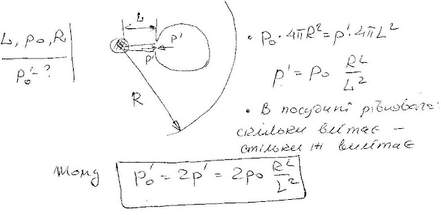
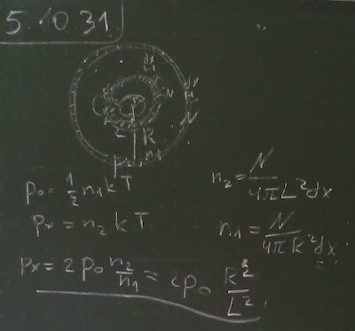

###  Условие:

$5.10.31^*.$ Внутри откачанного сосуда (см. задачу [5.10.30](../5.10.30)) на расстоянии $L$ от капли поставили другой сосуд с небольшим отверстием, обращенным в сторону этой капли. Какое давление пара жидкости установится в сосуде с отверстием?

###  Решение:

###  Альтернативное решение:

#### Ответ: $P = 2P_0(R/L)^2$