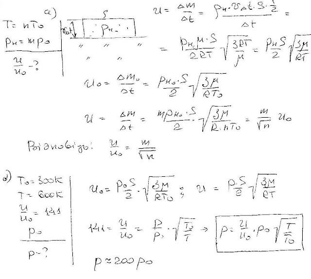
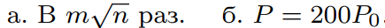

###  Условие: 

$5.10.32.$ а. Во сколько раз увеличивается скорость испарения твердого вещества в вакууме при увеличении его температуры в $n$ раз, если давление насыщенных паров при этом увеличивается в $m$ раз? б. При увеличении температуры твердого вещества с $300$ до $600 \,K$ скорость его испарения увеличилась в $141$ раз. Давление насыщенного пара при температуре $300 \,K$ равно $P_0$. Определите давление насыщенного пара при $600 \,K$. 

###  Решение: 

 

###  Ответ: 

 
