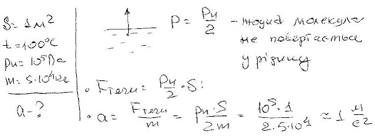

###  Условие:

$5.10.33.$ Определите максимальное ускорение водяной ракеты, тяга которой создается испарением воды при температуре $100 \,^{\circ}C$. Масса ракеты $50 \,т$, площадь испарения $1 \,м^2$

###  Решение:

###  Ответ: $a = 1.0 \,м/с^2$