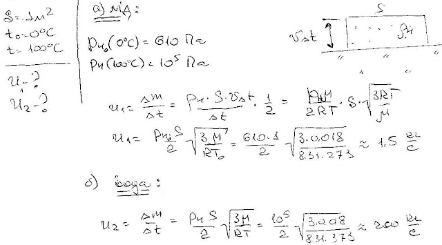

###  Условие:

$5.10.34.$ Оцените максимальную скорость испарения с поверхности $1 \,м^2$ льда при $0 \,^{\circ}C$ и с поверхности воды при $100 \,^{\circ}C$.

###  Решение:

###  Ответ:

$$
m_{1}=1{,}7\mathrm{~кг/с},~m_{2}=170\mathrm{~кг/с}.
$$