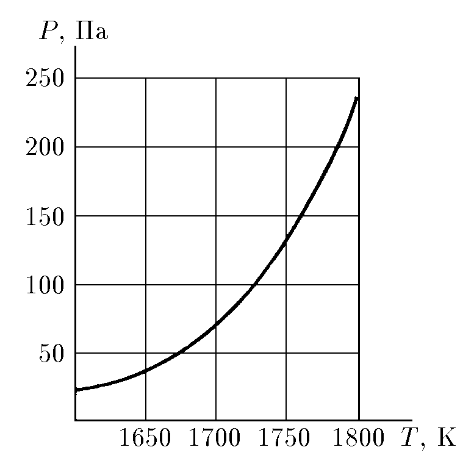
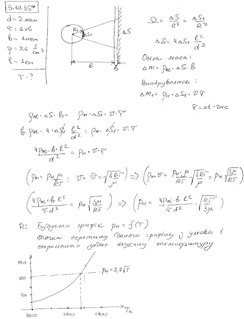

###  Условие:

$5.10.35^*.$ Испаряющийся алюминиевый шарик диаметра $2 \,мм$ напыляет в течение $1 \,мин$ на холодную плоскую поверхность, обращенную в сторону шарика, алюминиевую пленку толщины $1 \,мкм$. Плотность алюминия $2.6 \,г/см^3$, напыляемая поверхность находится на расстоянии $1 \,см$ от шарика. Оцените, пользуясь рисунком, на котором изображена температурная зависимость давления насыщенного пара алюминия, температуру алюминиевого шарика.

###  Решение:

###  Ответ: $T \approx 1720 \,К$