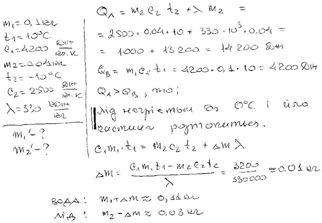

###  Условие:

$5.10.6.$ В $100 \,г$ воды при температуре $10 \,^{\circ}C$ опущено $40 \,г$ льда, имеющего температуру $-10 \,^{\circ}C$. При каком соотношении воды и льда возникнет состояние теплового равновесия в этой системе, если она теплоизолирована? Удельная теплоемкость льда $2.5 \,кДж/кг$.

###  Решение:

#### Ответ: Смесь $100.5 \,г$ воды и $30.5 \,г$ льда при $0 \,^{\circ}C$