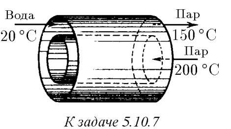
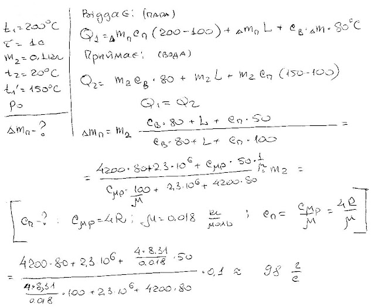

###  Условие: 

$5.10.7.$ Теплообменник состоит из двух длинных коаксиальных труб. По внутренней трубе медленно пропускается водяной пар, имеющий начальную температуру $200 \,^{\circ}C$. Во внешнюю трубу противотоком поступает в единицу времени $0.1 \,кг$ воды при температуре $20 \,^{\circ}C$. Вода выходит с противоположной стороны в виде пара с температурой $150 \,^{\circ}C$. Какая масса пара поступает во внутреннюю трубу теплообменника в единицу времени? Давление пара в трубах атмосферное 

 

###  Решение: 

 

###  Ответ: $m = 98 \,г/с$ 
