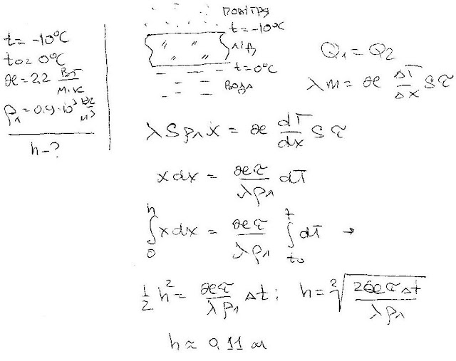

###  Условие:

$5.10.8^*.$ Оцените толщину льда, образующегося за сутки на поверхности озера при температуре воздуха $-10 \,^{\circ}C$. Теплопроводность льда $2.2 \,Вт/(м \cdot K)$, его плотность $0.9 \cdot 10^3 \,кг/м^3$.

###  Решение:

#### Ответ: $x \approx 0.11 \,м$