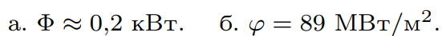

###  Условие: 

$5.11.1.$ Тело, нагретое до температуры $T$, излучает с единицы площади своей поверхности в единицу времени энергию (плотность потока энергии), пропорциональную четвертой степени температуры: $\varphi = \varepsilon \sigma T^4$ , где $\varepsilon < 1$ — степень черноты тела, $\sigma = 5.672·10^{−8} \,Вт/(м^2\cdot K^4)$ — постоянная Стефана — Больцмана, $T$ — температура. а. Оцените, сколько тепловой энергии излучает в единицу времени ваше тело (поток энергии с поверхности вашего тела). Степень черноты тела принять равным $0.3$. б. Солнце излучает как абсолютно черное тело при температуре $6300 \,K$. Определите, какова плотность потока энергии с поверхности Солнца. 

###  Решение: 

 

###  Ответ: 

 
