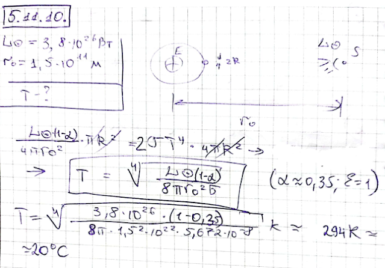

###  Условие:

$5.11.10.$ Какая температура установится внутри сферического спутника, который движется вокруг Земли, все время оставаясь освещенным Солнцем? Спутник не имеет внутренних источников энергии.

###  Решение:

#### Ответ: $T = 20 \,^{\circ}C$