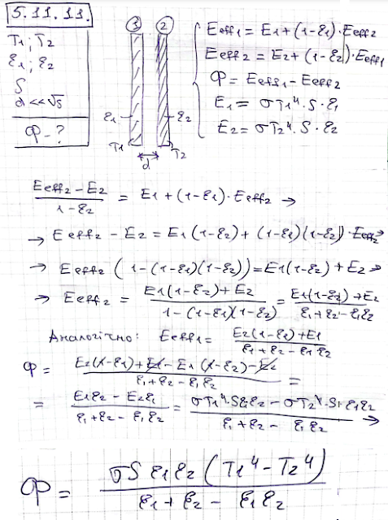

###  Условие:

$5.11.11^*.$ Определите тепловой поток (тепловую мощность), передаваемый от одной параллельной пластины к другой, если температура пластин $T_1$ и $T_2$, а степень черноты соответственно $\varepsilon_1$ и $\varepsilon_2$. Площадь каждой пластины $S$, зазор между пластинами много меньше их размеров

###  Решение:

#### Ответ:

$$
\Phi=\frac{\varepsilon_1\varepsilon_2}{\varepsilon_1+\varepsilon_2-\varepsilon_1\varepsilon_2}\sigma S(T_1^4-T_2^4).
$$