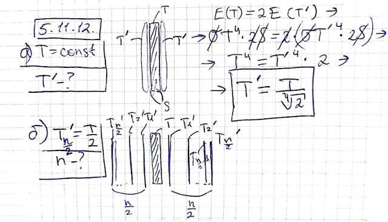
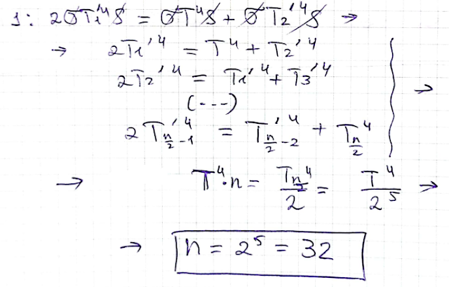
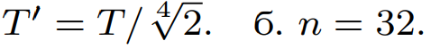

###  Условие: 

$5.11.12.$ Температура $T$ средней нагретой пластины поддерживается постоянной. а. Чему равна температура внешних экранирующих пластин? б. Сколько экранирующих пластин нужно поставить с обеих сторон средней пластины, чтобы уменьшить температуру внешней экранирующей пластины до $T/2$? 

###  Решение: 

 

 

###  Ответ: 

 
