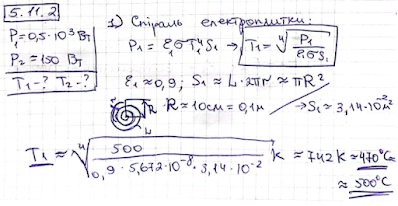
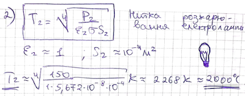

###  Условие:

$5.11.2.$ Оцените температуру спирали электроплитки мощности $0.5 \,кВт$ и нити накала электролампы мощности $150 \,Вт$. Принять, что теплопередача осуществляется только излучением.

###  Решение:

#### Ответ: $T_1 \approx 600\,^{\circ}C,\, T_2 \approx 2000\,^{\circ}C$