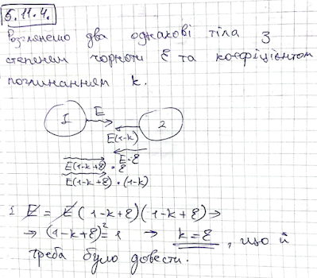

###  Условие: 

$5.11.4.$ Используя условие теплового равновесия двух тел, которые обмениваются энергией через тепловое излучение, докажите, что степень черноты тела равна коэффициенту поглощения излучения этим телом. 

###  Доказательство: 

 
