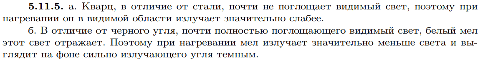

###  Условие: 

$5.11.5.$ а. «Нагревая кусок стали, мы при температуре $T = 800 \,^{\circ}C$ будем наблюдать яркое вишнево-красное свечение, но прозрачный стерженек плавленного кварца при той же температуре совсем не светится» (Ландсберг Г. С. Оптика. М.: Наука, 1976). Объясните этот эффект. б. Почему мел выглядит среди раскаленных углей темным? 

###  Решение: 

 
