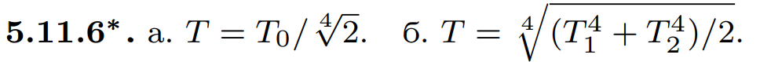

###  Условие: 

$5.11.6^{∗}.$ а. Определите температуру металлического шара вблизи плоской черной поверхности, нагретой до температуры $T_0$. 

б. Определите температуру шара, который находится между двумя параллельными черными плоскостями, нагретыми до температуры $T_1$ и $T_2$. 

###  Решение: 

 

 

###  Ответ: 

 
