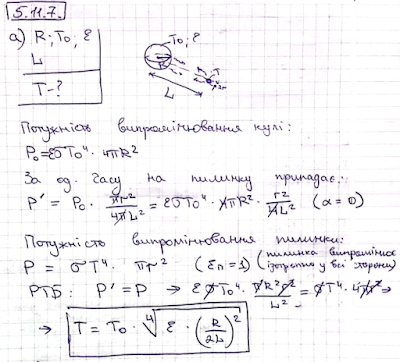
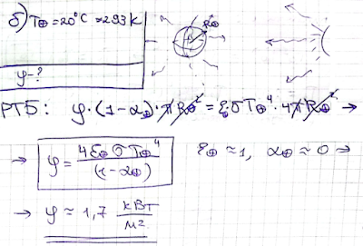

###  Условие:

$5.11.7.$ а. Шар радиуса $R$ нагрет до температуры $T_0$. Степень черноты поверхности шара $\varepsilon $. Определите температуру сферической пылинки, находящейся на расстоянии $L$ от центра шара.
б. Оцените плотность энергии, приходящей с Солнца на Землю, если средняя температура поверхности Земли $20 \,^{\circ}C$.

###  Решение:

###  Ответ:

$$
\mathrm{а.~}T=T_0\sqrt{\varepsilon(R/2L)^2}.\quad\mathrm{б.~}\varphi=1,7\mathrm{~кВт}/\mathrm{м}^2.
$$