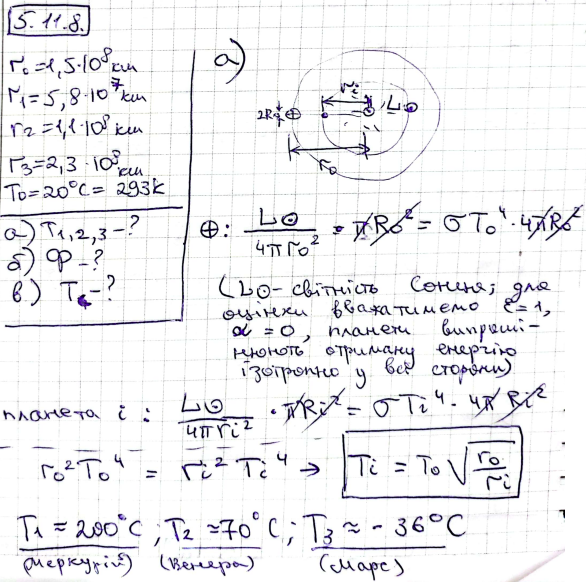
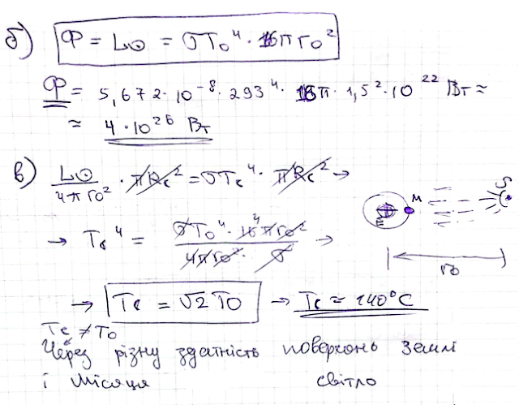

###  Условие: 

$5.11.8.$ Расстояния между Солнцем и планетами Земля, Меркурий, Венера и Марс равны $1.5 \cdot 10^8; \,5,8 \cdot 10^7 ; \,1.1 · 10^8$ и $2.3 \cdot 10^8$ км. Средняя температура поверхности Земли $20 \,^{\circ}C$. 
а. Оцените среднюю температуру поверхности Меркурия, Венеры и Марса. 
б. Оцените поток энергии с поверхности Солнца. 
в. Оцените температуру поверхности Луны в момент, когда солнечные лучи перпендикулярны ее поверхности. Почему при этом же условии такая температура не наблюдается на поверхности Земли? 

###  Решение: 

 

 

###  Ответ: 

a. $T=200{,}~70{,}~-35^{\circ}\mathrm{C.}$
б. $\Phi\approx4\cdot10^{26}~\mathrm{Вт.}$
в. $T=140~^{\circ}\mathrm{C.}$