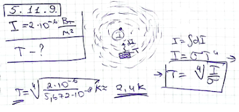

###  Условие:

$5.11.9.$ Плотность потока излучения звездного неба около $2 \cdot 10^{−6} \,Вт/м$. Оцените, пользуясь этой величиной, температуру внутригалактической пыли

###  Решение:

###  Ответ: $T = 2.4 \,К$