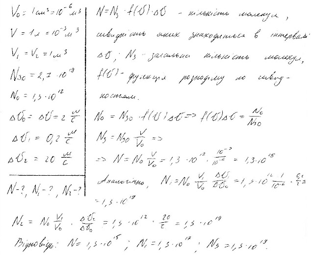

###  Условие:

$5.2.1.$ В $1 \,см^3$ при давлении $0.1 \,МПа$ находится $2.7 \cdot 10^{19}$ молекул азота. Число молекул, вертикальная составляющая скорости которых лежит в интервале от $999$ до $1001 \,м/с$, равно $1.3 \cdot 10^{12}$. а. Какое число таких молекул содержитсяв $1 \,л$ азота? б. Сколько молекул азота, имеющих вертикальную составляющую скорости в интервалах $1000 \pm 0.1$ и $1000 \pm 10$ м/с, содержится в $1 \,м^3$? Считать, что число молекул, обладающих скоростью, лежащей в некотором интервале скоростей, пропорционально этому интервалу

###  Решение:

#### Ответ:

а. $N=1{,}3\cdot10^{15}\mathrm{~л}^{-1}$
б. $N_1=1{,}3\cdot10^{17}\mathrm{~м}^{-3}; ~N_2=1{,}3\cdot10^{19}\mathrm{~м}^{-3}.$