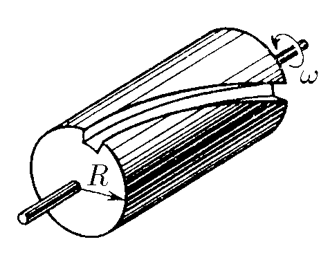

###  Условие:

$5.2.10.$ Отверстие в стенке перекрыто цилиндрической пробкой. На поверхности пробки прорезан узкий винтовой канал с шагом $h$. По одну сторону стенки находится разреженный газ, по другую — вакуум. Молекулы газа легко поглощаются стенками канала. Пробка вращается с угловой скоростью $\omega$. Какой скоростью будут обладать молекулы, прошедшие по каналу?

###  Решение:

Через канал, ввиду поглощения им молекул, могут пролетать только молекулы, имеющие скорости, совпадающие с линейной скоростью стенки канала.

Шаг винтовой линии связан с периодом враще ния пробки и линейной скоростью уравнением $h=vT$. Период вращения можно выразить через угловую ско- рость вращения

$$
Т=2\pi / \omega
$$

Таким образом, уравнение шага винтовой линии преобразуется к виду

$$
h = \frac{v \cdot 2 \pi}{\omega}\Rightarrow v = \frac{h \omega}{2 \pi}
$$

####  Ответ: $v = h\omega /(2\pi )$