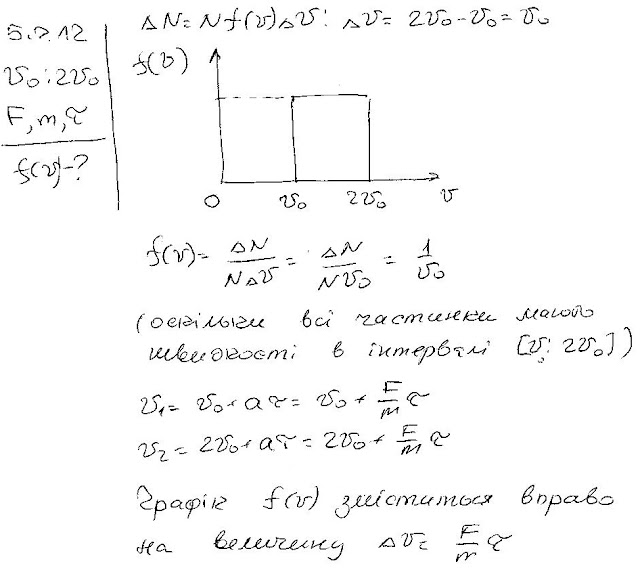

###  Условие:

$5.2.12.$ Скорости частиц, движущихся в потоке, имеют одно направление и лежат в интервале от $v_0$ до $2v_0$. График функции распределения частиц по скоростям имеет вид прямоугольника. Чему равно значение функции распределения? Как изменяется функция распределения, если на частицы в течение времени $\tau$ вдоль их скорости действует сила $F$? Масса каждой частицы равна $m$.

###  Решение:

#### Ответ: $f(v)=1/v_0$ при $v_0\leqslant v\leqslant2v_0$ в остальной области значений $v$. Функция распределения $f(v)$ сдвинется на $\Delta v=F\tau/m$ в область больших скоростей.