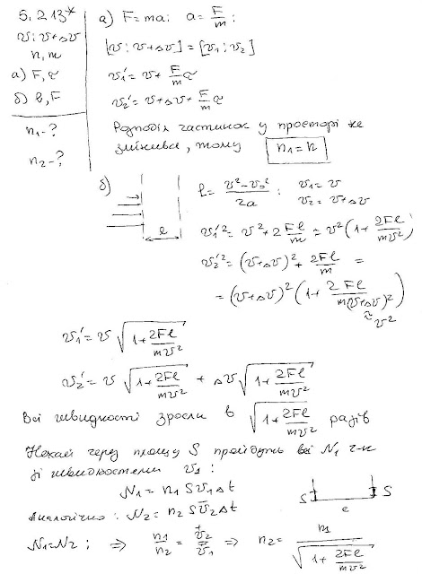

###  Условие:

$5.2.13^*.$ Скорости частиц в пучке имеют одно направление и лежат в интервале от $v$ до $v + \Delta v$ $(\Delta v \ll v)$. В единице объема пучка находится $n$ частиц, Масса каждой частицы $m$. а. В течение времени $\tau$ на частицы в направлении их движения действует сила $F$. Определите интервал скоростей и число частиц в единице объема после действия силы. б. Определите интервал скоростей и число частиц в единице объема после прохождения области, где на расстоянии $l$ вдоль направления движения на частицы действовала сила $F$

###  Решение:

#### Ответ:

$\mathrm{a.}v_{\mathrm{мин}}=v+\frac{Fr}{m},$ $v_{\mathrm{макс}}=v+\frac{Fr}{m}+\Delta v,n^{\prime}=n.$ б. $v_{\mathrm{мин}}=v\sqrt{1+2\frac{Fl}{mv^{2}}},$ $v_{\mathrm{макс}}=(v+\Delta v)\sqrt{1+2\frac{Fl}{m(v+\Delta v)^{2}}}

$$
\approx v\sqrt{1+\frac{Fl}{mv^{2}}}+\Delta v/\sqrt{1+2\frac{Fl}{mv^{2}}},
$$

n^{\prime}=n/\sqrt{1+2\frac{Fl}{mv^{2}}}.
$