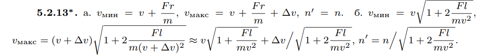

###  Условие: 

$5.2.13^*.$ Скорости частиц в пучке имеют одно направление и лежат в интервале от $v$ до $v + \Delta v$ $(\Delta v \ll v)$. В единице объема пучка находится $n$ частиц, Масса каждой частицы $m$. а. В течение времени $\tau$ на частицы в направлении их движения действует сила $F$. Определите интервал скоростей и число частиц в единице объема после действия силы. б. Определите интервал скоростей и число частиц в единице объема после прохождения области, где на расстоянии $l$ вдоль направления движения на частицы действовала сила $F$ 

###  Решение: 

 

###  Ответ: 

 
