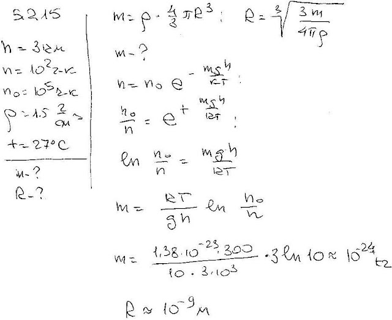
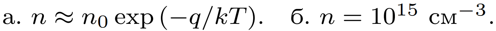

###  Условие: 

$5.2.15.$ На высоте $3 \,км$ над поверхностью Земли в $1 см^3$ воздуха содержится примерно $10^2$ пылинок, а у самой поверхности — примерно $10^5$. Определите среднюю массу пылинки и оцените ее размер, предполагая, что плотность пылинки $1.5 \,г/см^3$. Температура воздуха $27 \,^{\circ}C$. 

###  Решение: 

 

###  Ответ: 

 
