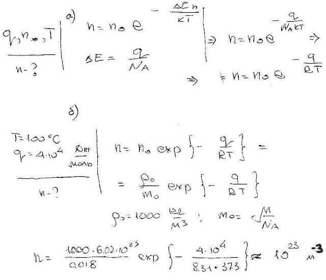

###  Условие: 

$5.2.17^*.$ Испарение жидкости можно рассматривать как «уход» с ее поверхности быстрых молекул, т. е. тех молекул, кинетическая энергия которых больше энергии связи молекул в жидкости. Испарение жидкости прекращается, как только число уходящих молекул сравняется с числом молекул, которые приходят в жидкость из ее пара. Пар, состоящий из тех же молекул, что и жидкость, носит название «насыщенный пар», если он находится в равновесии с жидкостью. а. Оцените число молекул в единице объема насыщенного пара при температуре $T$, если молярная теплота парообразования жидкости равна $q$, а число молекул в единице объема жидкости равно $n_0$. Молекулы в жидкости и ее газовой фазе (в паре) имеют максвелловское распределение по скоростям. б. При температуре $100 \,^{\circ}C$ молярная теплота парообразования воды — около $4 \cdot 10^4 \,Дж/моль$. Оцените число молекул воды в насыщенном паре при $100 \,^{\circ}C$. 

###  Решение: 

 

####  Ответ: $\mathrm{a.~}n\approx n_{0}\exp{(-q/kT)}.\quad\mathrm{б.~}n=10^{15}\mathrm{~c}\mathrm{м}^{-3}.$
