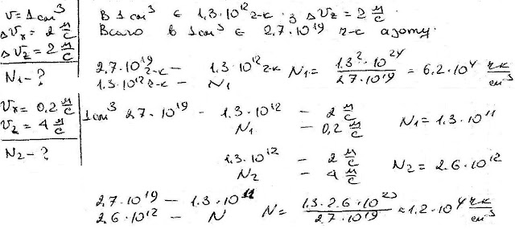

###  Условие: 

$5.2.2.$ Распределения молекул по проекциям $v_i$ скорости на оси координат $(i = x, y, z)$ взаимно независимы. Пользуясь этим, определите в задаче [5.2.1](../5.2.1) число молекул азота в $1 \,см^3$, горизонтальные составляющие скоростей которых, так же как и вертикальные, лежат в интервале от $999$ до $1001 \,м/с$: число молекул, горизонтальные составляющие скоростей которых лежат в интервале $1000\pm 0.1 \,м/с$, а вертикальные — в интервале $1000 \pm 2 \,м/с$ 

###  Решение: 

 

###  Ответ: 

 
