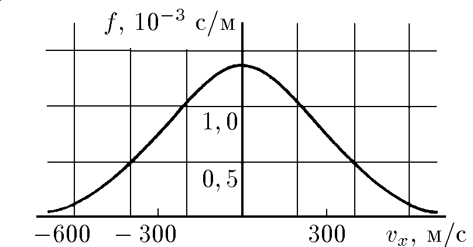

###  Условие:

$5.2.3.$ Число молекул однородного идеального газа $dN$, скорость которых вдоль произвольной оси $x$ лежит в интервале ($v_x$, $v_x + dv_x$), из общего числа $N$ его молекул при данной температуре $T$ определяется распределением Максвелла:

$$
\begin{aligned}
dN=N\sqrt{\frac{m}{2\pi kT}}\exp\left(-\frac{mv_x^2}{2kT}\right)dv_x=Nf(v_x)dv_x,
\end{aligned}
$$

где $m$ — масса молекулы, $k$ — постоянная Больцмана. Функция

$$
f(v_x)=\sqrt{\frac{m}{2\pi kT}}\exp\left(-\frac{mv_x^2}{2kT}\right)
$$

называется функцией распределения. На рисунке приведена функция распределения молекул азота при комнатной температуре ($T = 293 \,K$). Используя график, найдите:
а) сколько в $1 \,см^3$ воздуха содержится молекул азота, имеющих в некотором направлении скорость в интервале от $499$ до $501 \mathrm{~м/с}$
б) сколько в $1 \,м^3$ содержится молекул азота, имеющих в некотором направлении скорость в интервале от $498$ до $502 \,м/с$, если число $N$ молекул азота в $1 см^3$ равно $2 \cdot 10^{19}$.

###  Решение:

__Cлучай а:__

Число молекул в заданном интервале скоростей вычисляется как:

$$
N_1 = N \sqrt{\frac{m}{2 \pi k T}} \exp \left( - \frac{m \bar{v}_x^2}{2 k T} \right) \Delta \bar{v}_x\tag{1}
$$

где $ \Delta \bar{v}_x $ — ширина интервала скоростей, $N$ — число молекул азота в $1 см^3$, $\bar{v}_x$ — средняя скорость в выбранном интервале

По-условию, численное значение данных величин:

$$
N = 2 \times 10^{19} \, \text{см}^{-3}, \quad \bar{v}_x = 500 \, \frac{\text{м}}{\text{с}}, \quad \Delta \bar{v}_x = 2 \, \frac{\text{м}}{\text{с}}
$$

Подставляем численные величины в выражение $(1)$ и получаем количество молекул азота для случая а:

$$
\boxed{N_1 \approx10^{16}\mathrm{~cм}^{-3}}
$$

__Cлучай б:__

Аналогично находим через распределение скоростей находим искомое количество молекул:

$$
N_2 = N \sqrt{\frac{m}{2 \pi k T}} \exp \left( - \frac{m \bar{v}_x^2}{2 k T} \right) \Delta \bar{v}_x'
$$

Численное значение, по-условию:

$$
N = 2 \times 10^{19} \, \text{см}^{-3}, \quad \bar{v}_x = 500 \, \frac{\text{м}}{\text{с}}, \quad \Delta \bar{v}_x' = 4 \, \frac{\text{м}}{\text{с}}
$$

Подставляя значения, получаем:

$$
\boxed{N_2\approx2\cdot10^{22}\mathrm{~м}^{-3}}
$$

#### Ответ:

$$
\begin{aligned}
\mathrm{a)} N_1 & \approx10^{16}\mathrm{~cм}^{-3},\quad\mathrm{б)~}N_2\approx2\cdot10^{22}\mathrm{~м}^{-3}.
\end{aligned}
$$