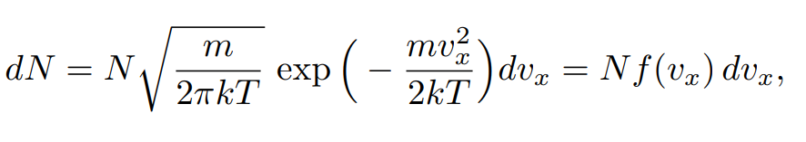
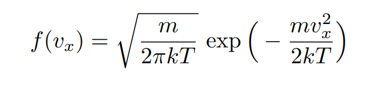
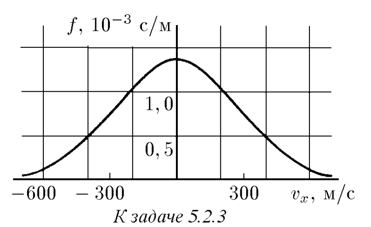
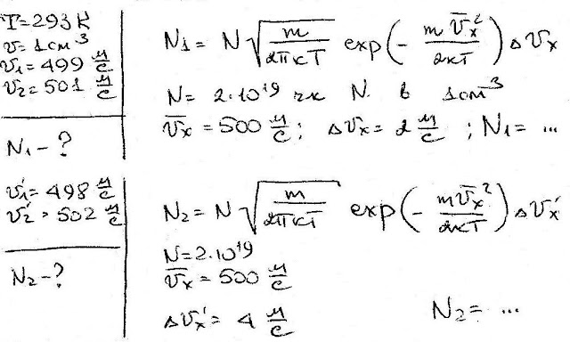
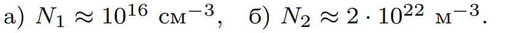

###  Условие: 

$5.2.3.$ Число молекул однородного идеального газа $dN$, скорость которых вдоль произвольной оси $x$ лежит в интервале ($v_x$, $v_x + dv_x$), из общего числа $N$ его молекул при данной температуре $T$ определяется распределением Максвелла: 

 

где $m$ — масса молекулы, $k$ — постоянная Больцмана. Функция 

 

называется функцией распределения. На рисунке приведена функция распределения молекул азота при комнатной температуре ($T = 293 \,K$). Используя график, найдите: а) сколько в $1 \,см^3$ воздуха содержится молекул азота, имеющих в некотором направлении скорость в интервале от 499 до 501 м/с, б) сколько в $1 \,м^3$ содержится молекул азота, имеющих в некотором направлении скорость в интервале от $498$ до $502 \,м/с$, если число молекул азота в $1 см^3$ равно $2 \cdot 10^{19}$. 

 

###  Решение: 

 

###  Ответ: 

 
