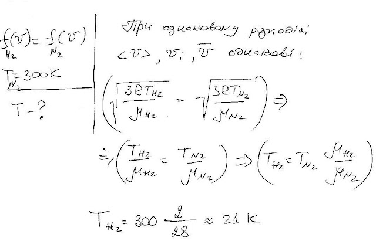

###  Условие:

$5.2.4.$ При какой температуре функция распределения по скоростям молекул водорода будет совпадать с функцией распределения по скоростям молекул азота при комнатной температуре.

###  Решение:

###  Ответ: $T = 21 \,К$