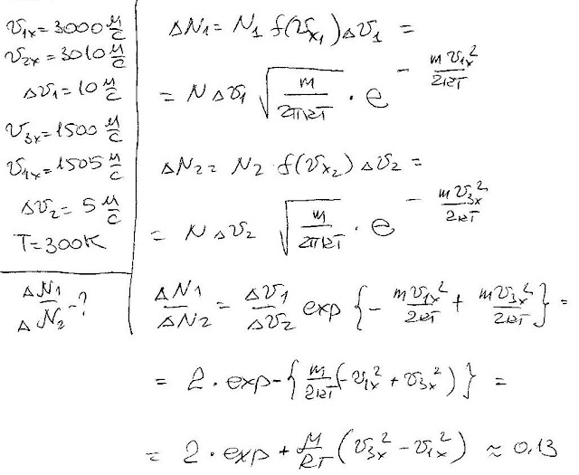

###  Условие:

$5.2.5.$ Найдите отношение числа молекул водорода, имеющих проекцию скорости на ось $x$ в интервале от $3000$ до $3010 \,м/с$, к числу молекул водорода, имеющих проекцию скорости на ту же ось в интервале от $1500$ до $1505 \,м/с$. Температура водорода $300 \,K$.

###  Решение:

###  Ответ: $n = 0.13$