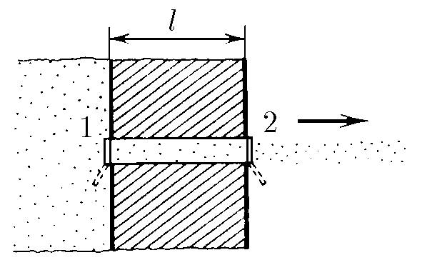
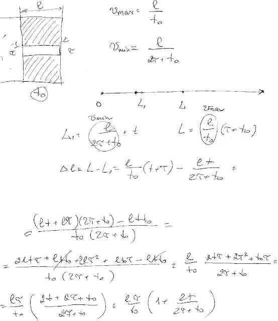

###  Условие: 

$5.2.8^*.$ В толстой стенке сосуда, содержащего газ, сделан прямой канал длины $l$, который соединяет сосуд с вакуумным пространством. Для формирования пучка молекул канал снабжен двумя затворами. Затвор $1$ расположен на выходе канала в сосуд, затвор $2$ — на выходе канала в вакуумное пространство. Пучок молекул формируется следующим образом: сначала на время $\tau$ открывают затвор $1$, затем, после того как этот затвор закроется, через время $t_0$ открывается на время $\tau$ затвор $2$. Молекулы, пролетевшие во время этого процесса канал, образуют в вакуумном пространстве пучок. Чему равна длина этого пучка через время $t$ после закрывания затвора $2$? 

###  Решение: 

 

###  Ответ: $L = l \frac{\tau}{\tau_0}(1+ \frac{2t}{t_0+2\tau})$ 
